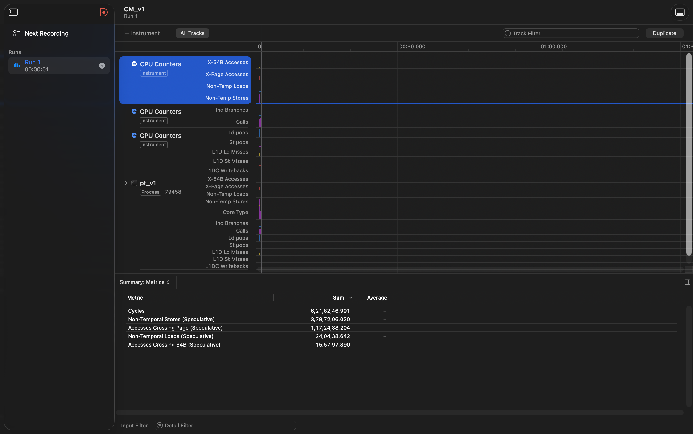
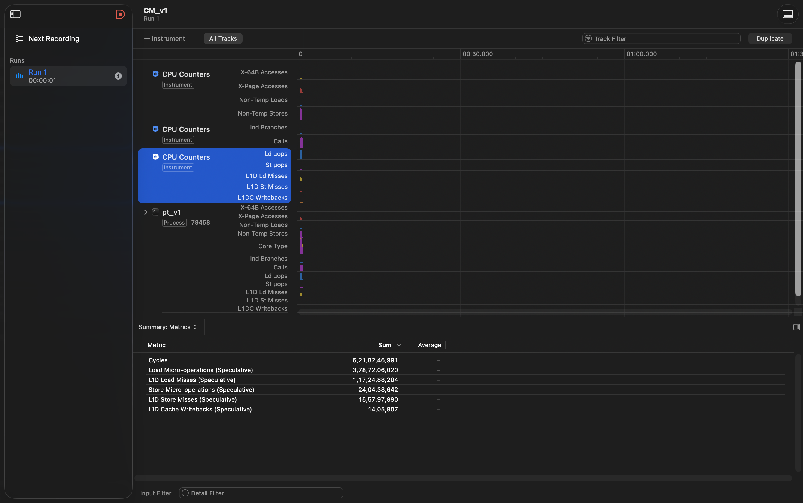
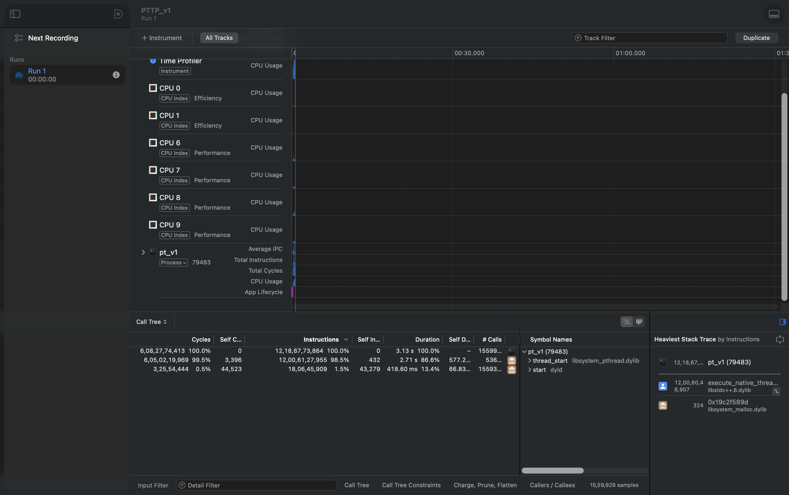
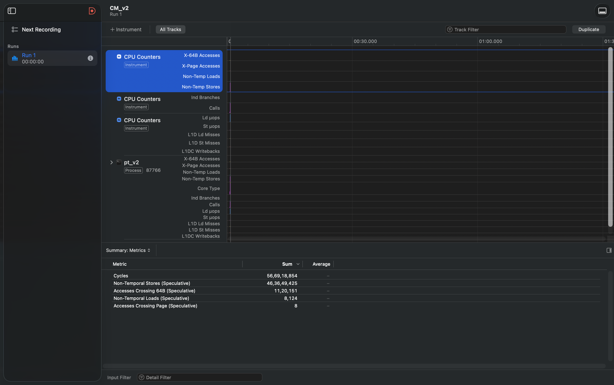
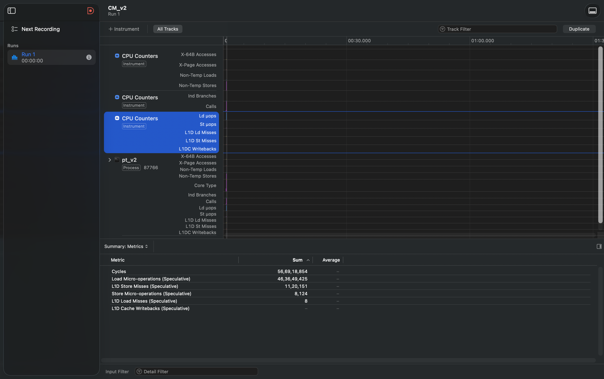
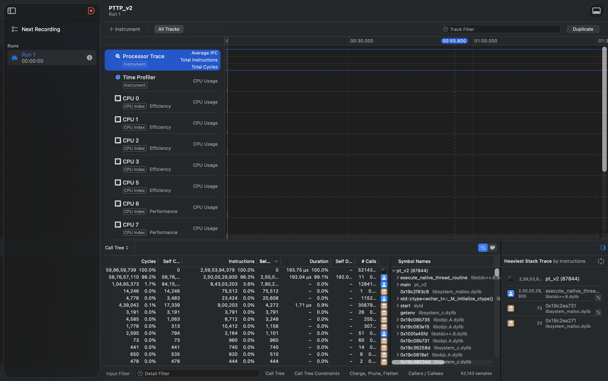

# AoS vs SoA
## Introduction
This problem documents how different layouts affect performance. **AoS(Array of Structures)** is when a single structure contains all relevant information of a unit, and all units are stored in a single array. In our use case, an AoS implementation is much slower, due to higher cache line fetches, caused by usage of only few bytes within the cache line, which increases eviction, reflected in the higher number of load misses. This is because a single cache line brings in 2 units, within which only specific fields remain used before a new cache line is required.

**SoA (Structure of Arrays)** is when the data fields of a unit are distributed within different arrays. Here cache line fetches usually bring adjacent indices/elements within the arrays, and with aggressive compilation (due to regular stride and non aliasing) as well as hardware prefetching, we see a much faster program (10x increase) with **8** L1 load misses. This is a much better improvement compared to AoS.

## Where AoS could potentially beat SoA
When all fields of a unit are to be used, and all cache lines are constantly under use, then AoS could beat SoA. In our case we had certain blocks of code/ instructions which needed only specific fields. If within the same block of instructions we used all the fields of a unit, AoS would have an edge.
