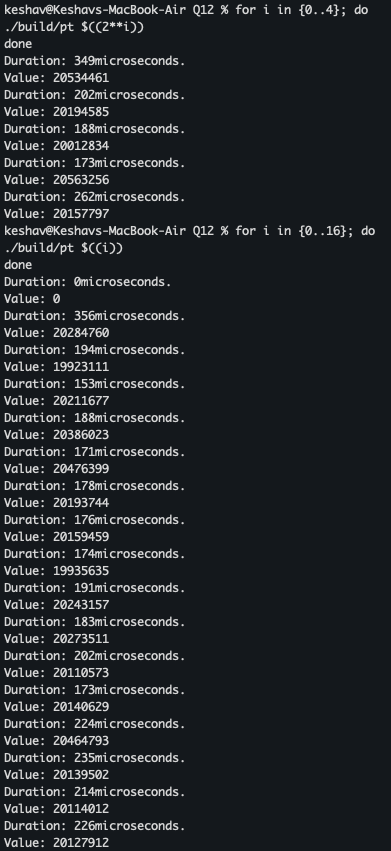

This question was based on looking at the real aspects of Amdahl's law and its effects in calculating speedup with parallelizable work.
I have taken the liberty of using a simpler formula instead of the actual Black-Scholes pricing model as its complexity doesnt serve any purpose wrt to my experiment/task.
This really made me think about all aspects of what tasks are conducted in parallel and what effectively gets serialized/sequentialized. Without this understanding, I was making incorrect measurements of what I thought to be the "parallel block" and what I thought to be the "sequential block" without realizing that those were intermeshed and very hardware/run dependent.
My terminal screenshot shows the effective speedup achieved, with minimal gains, and finally harm, after more threads.
