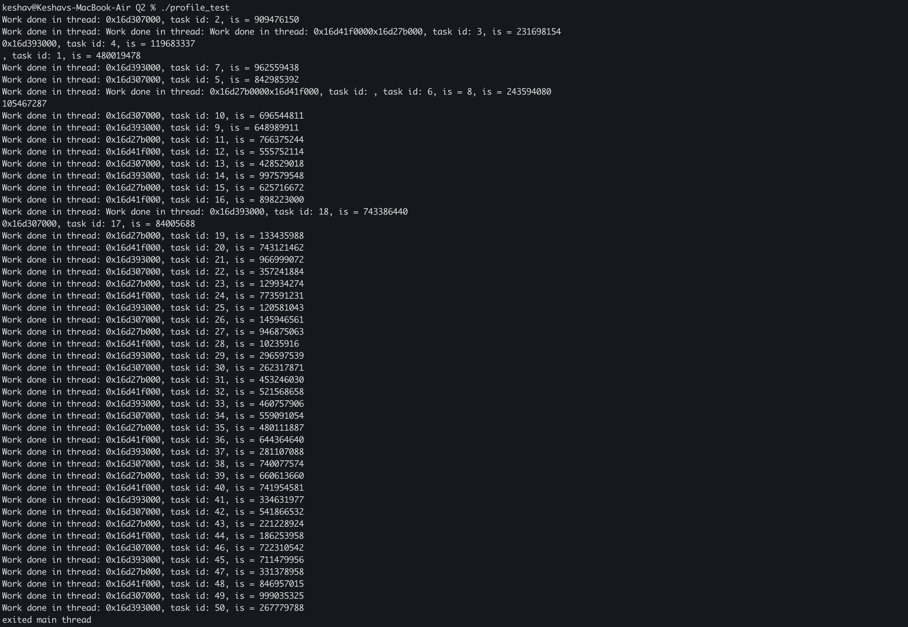

In this, I learnt basic producer consumer patterns, with the usage of mutexes and condition variables, allowing threads to access shared resources only when a certain condition is true. Also learnt the usage of flags in order to allow graceful termination of threads. 
Have included a terminal screenshot where I forgot to hold std::cout under locks, which resulted in multiple writes to the buffer being interleaved among other writes. Thought it was funny.
