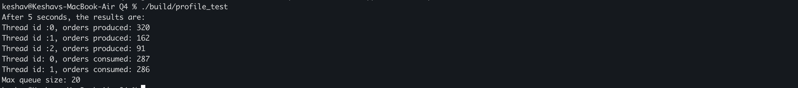

This was an interesting where I learnt a decent bit about the usage of various synchronization tools and overall features. My original code wasn't equipped for termination without actually seeing if all producers have terminated, leading to the usage of the atomic "activeProducers". Also was using std::memory_ordered_relaxed without fully understanding if it even applied in this use case, and learnt that it was not required due to fences already setup by other synchronization tools.
