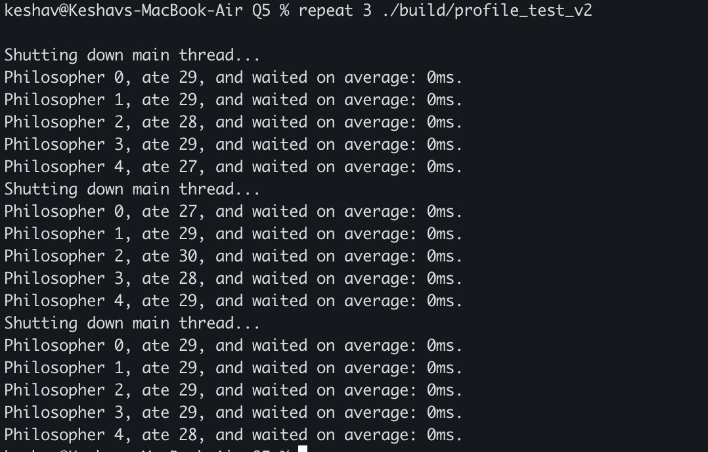
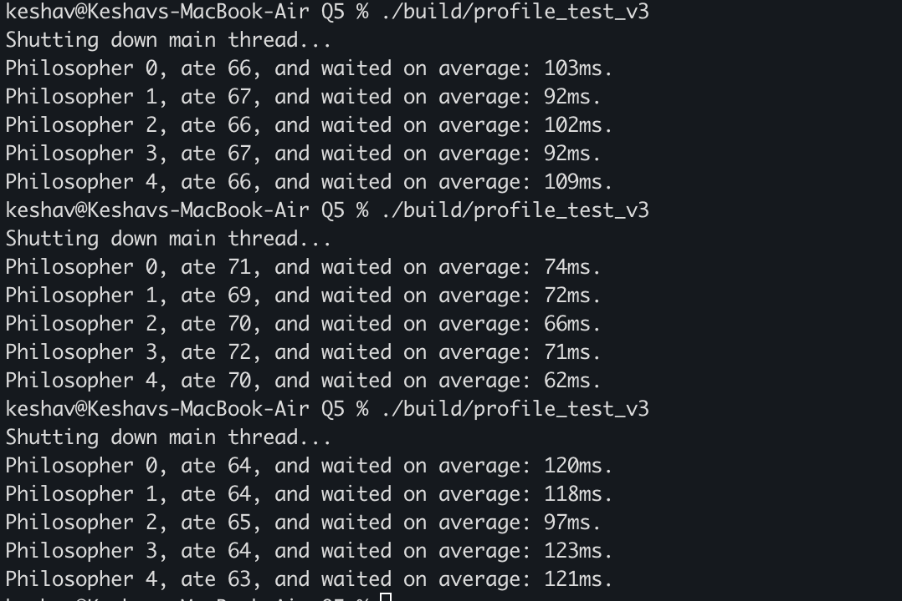

Learnt about the various methods of solving simple deadlock patterns exhibited by problems like the philosophers at the dining table.
Ordering based solutions prevent circular deadlock patterns from forming, while timed mutexes disallow holding shared resources and being stuck in busy waits.
Terminal screenshots of versions 2 and 3 are shown here. Note: 2 ran only for 10 seconds

