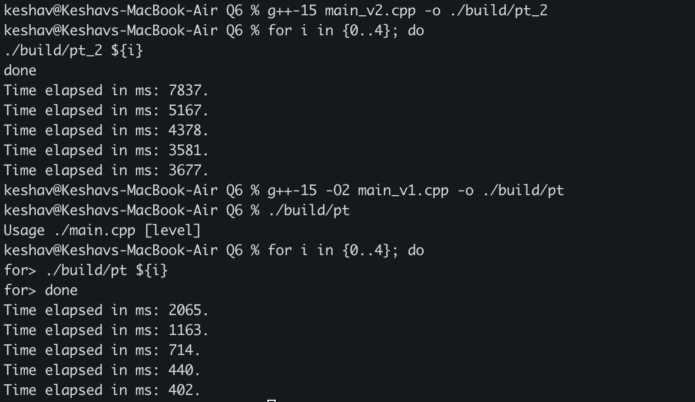

The first two tasks of this exercise were implemented in a single program, namely main_v1.cpp, by controlling the depth as a parameter passed to the thread.
Learnt about how threads decay copy, and why references have to be passed in a special wrapper.
On macOS, std::async is NOT implemented by worker queues, with work stealing. They are instead implemented using separate threads, as well as the promise of futures and synchronization. This makes it no different, and slightly worse as compared to our manual thread creation version.
On 5OM integers, the difference is stark.
